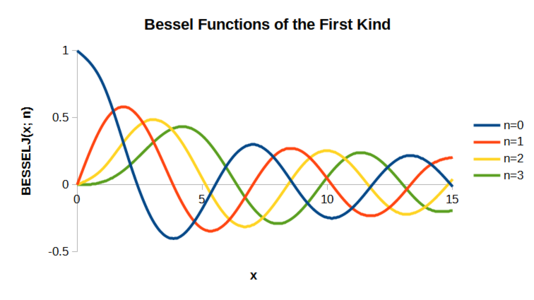

# Fonctions de Bessel

$$
x^{2}\, y_{xx}+x\,y_{x}+(x^{2}-\alpha^{2})y=0
$$
Avec $\alpha$ un nombre complexe arbitraire.

Les solutions de l'équation de Bessel sont catégorisées en fonction de $\alpha$.

### Fonctions de Bessel de Première Espèce

Ces fonctions de Bessel notées $J_{n}$ sont les seules qui sont définies en $0$.

L'abscicce du $n^{e}$ zéro de la $m^{e}$ fonction de Bessel de première espèce se note $z_{nm}$. Seule $J_{0}$ est non nulle à l'origine.
### Fonctions de Bessel de Seconde Espèce

Les fonctions de Bessel de seconde espèce ont un singularité à l'origine.